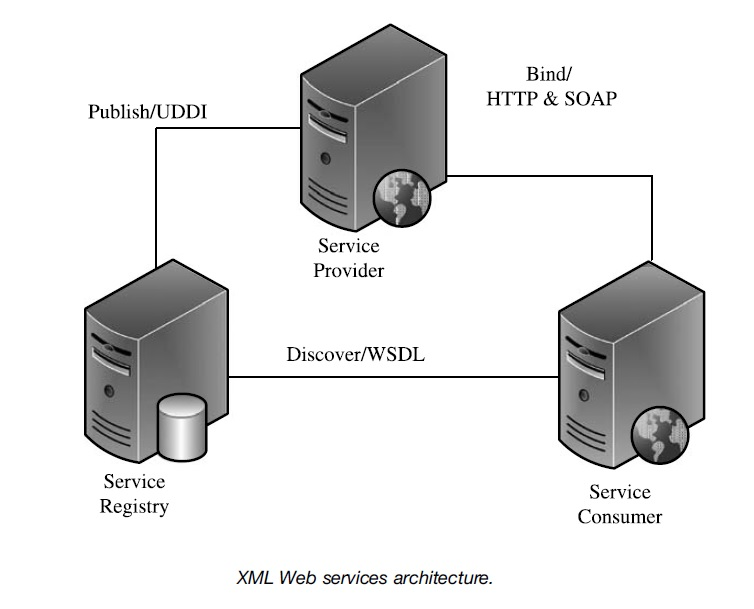

# Service-oriented architecture (SOA)

Service-oriented architecture (SOA) provides a new perspective for simplifying the
process of building large-scale, increasingly complex, and interwoven application
enterprise software systems. It has been gaining massive momentum as it promises
to solve enterprise application integration challenges more cost effectively than using
the traditional proprietary messaging protocol based approaches.
In achieving the goals of simplifying application integration, SOA emphasizes
the use of loosely coupled software services. In an SOA environment, resources are
distributed over networks and are made available as independent services, which
can be accessed without the knowledge of their underlying platform implementation.
At the highest level, an SOA-based enterprise application consists of service providers
and service consumers. A service consumer sends service requests to its service
provider, which renders the service requests and sends service responses back to the
service consumer. How the service requests and responses are represented or formatted
and how the service consumer and service provider communicate with each
other constitute the watershed for different styles of SOAs.

XML Web services are the most popular implementation of SOA today. XML
Web services infrastructure enables service publishing, discovery, and message
exchange between a service provider and its consumer. As shown in Figure 2.14,
there are three entities involved in XML Web services infrastructure: service
provider, service registry, and service consumer. The infrastructure follows three
open standards in the format of specifications: UDDI (Universal Description,
Discovery, and Integration) for service publishing, WSDL (Web Services Description
Language) for service discovery, and HTTP (HyperText Transport Protocol) and
SOAP (Simple Object Access Protocol) for message exchange between a service
provider and its consumer.
The term *bind* in Figure 2.14 describes the built-in infrastructure function of
enabling a service provider and its service consumer to communicate with each
other through exchanging messages that they both understand. Here is how it works
step by step:
† The request and response messages are encoded in text format by following a
special XML dialect called Simple Object Access Protocol (SOAP).
† The SOAP messages are sent back and forth between a service consumer and its
provider using the HTTP through a URL, although it may use other protocols
such as FTP or SMTP.
† Behind the scenes, the components developed in languages such as Java or C#
fulfill the service requests. The interfaces from those components are coded in
language-specific binary format. Therefore, SOAP serialization and deserialization
must happen when the SOAP messages arrive at and leave the component
interfaces.