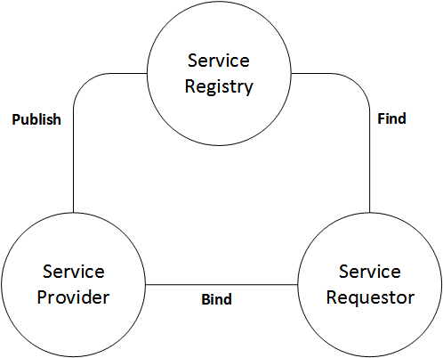

# What is a service?

```
A mechanism to enable access to one or more capabilities, where the access is provided using a prescribed interface ... with constraints and policies as specified by the service description.
```

